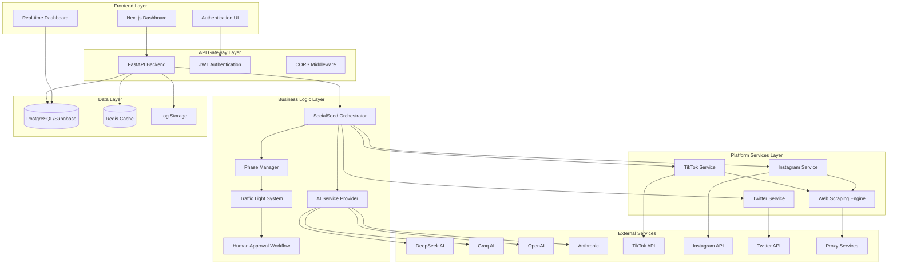
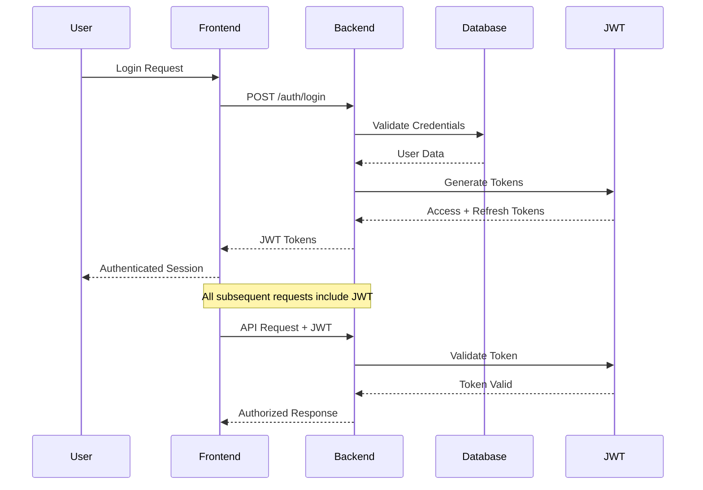
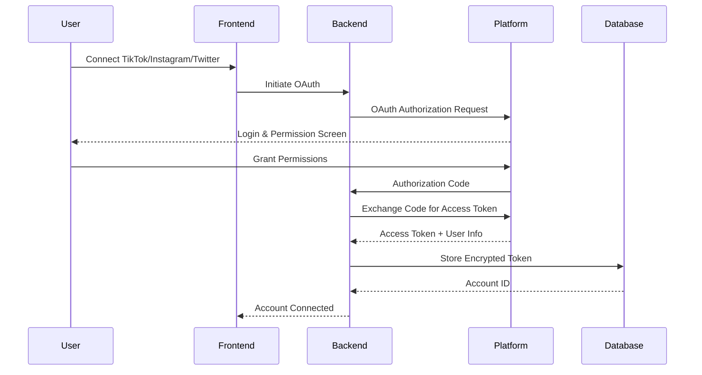
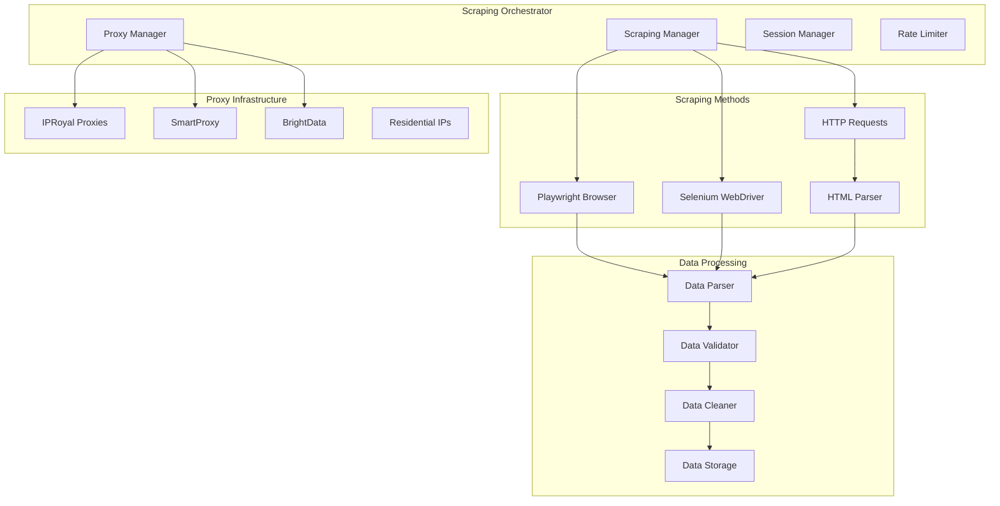
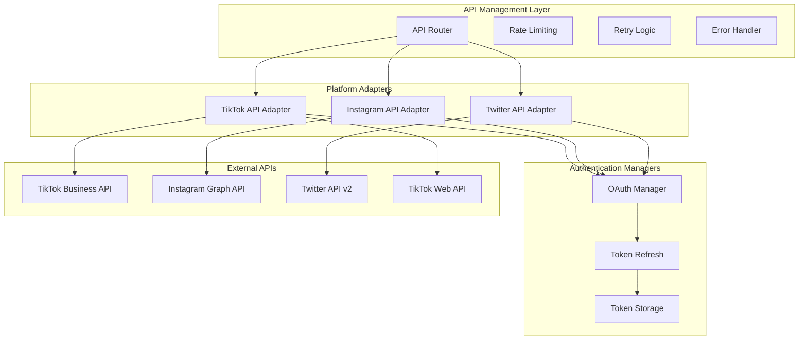
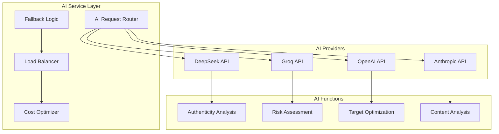
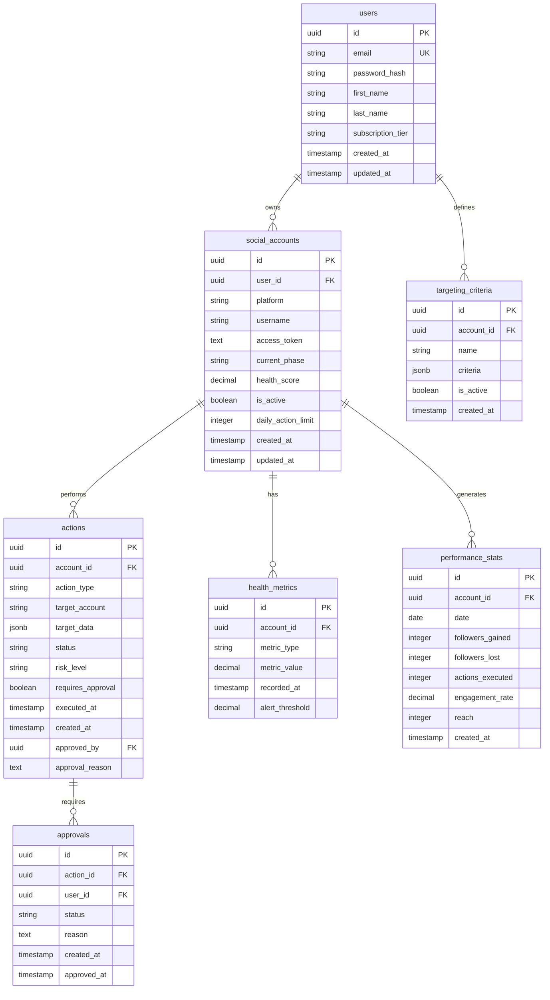
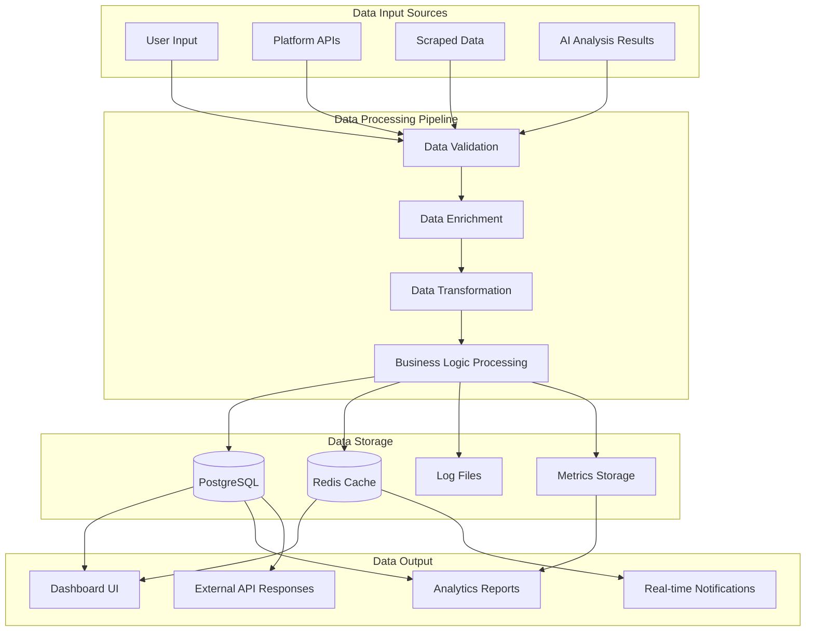
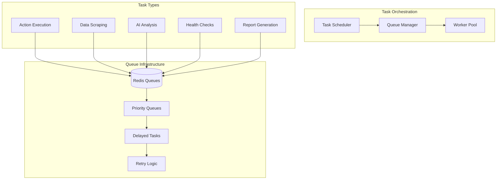
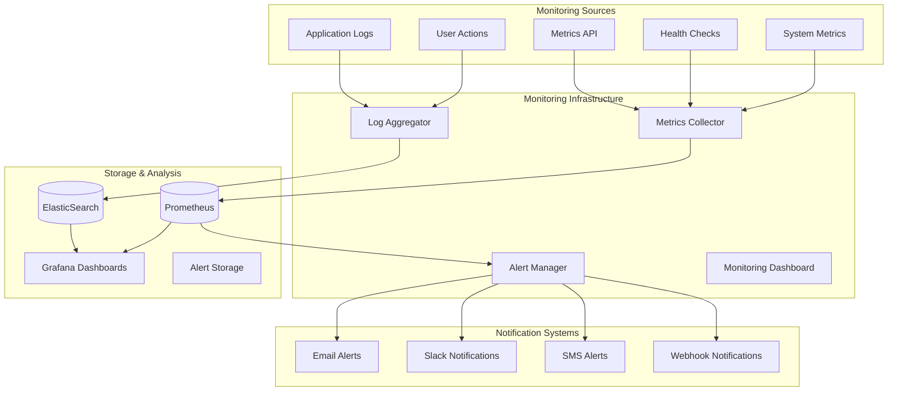

# SocialSeed v2.0 - Complete Technical Architecture Documentation

## 🏗️ System Architecture Overview

### High-Level System Interaction Flow



## 🔐 Authentication & Security Architecture

### User Authentication Flow



### Social Media Authentication Flow



### Security Implementation Details

#### JWT Token Management
```python
# backend/auth/jwt_handler.py
from jose import JWTError, jwt
from passlib.context import CryptContext
from datetime import datetime, timedelta

class JWTHandler:
    def __init__(self):
        self.SECRET_KEY = os.getenv("JWT_SECRET_KEY")
        self.ALGORITHM = "HS256"
        self.ACCESS_TOKEN_EXPIRE_MINUTES = 30
        self.REFRESH_TOKEN_EXPIRE_DAYS = 7
        
    def create_access_token(self, data: dict):
        to_encode = data.copy()
        expire = datetime.utcnow() + timedelta(minutes=self.ACCESS_TOKEN_EXPIRE_MINUTES)
        to_encode.update({"exp": expire, "type": "access"})
        return jwt.encode(to_encode, self.SECRET_KEY, algorithm=self.ALGORITHM)
        
    def verify_token(self, token: str):
        try:
            payload = jwt.decode(token, self.SECRET_KEY, algorithms=[self.ALGORITHM])
            return payload
        except JWTError:
            return None
```

#### Password Security
```python
# backend/auth/password_handler.py
from passlib.context import CryptContext

pwd_context = CryptContext(schemes=["bcrypt"], deprecated="auto")

class PasswordHandler:
    @staticmethod
    def hash_password(password: str) -> str:
        return pwd_context.hash(password)
        
    @staticmethod
    def verify_password(plain_password: str, hashed_password: str) -> bool:
        return pwd_context.verify(plain_password, hashed_password)
```

#### Token Encryption for Social Media APIs
```python
# backend/security/encryption.py
from cryptography.fernet import Fernet
import base64
import os

class TokenEncryption:
    def __init__(self):
        key = os.getenv("ENCRYPTION_KEY")
        if not key:
            key = Fernet.generate_key()
        self.cipher = Fernet(key)
        
    def encrypt_token(self, token: str) -> str:
        encrypted = self.cipher.encrypt(token.encode())
        return base64.b64encode(encrypted).decode()
        
    def decrypt_token(self, encrypted_token: str) -> str:
        encrypted = base64.b64decode(encrypted_token.encode())
        return self.cipher.decrypt(encrypted).decode()
```

## 🕷️ Web Scraping & Data Collection Architecture

### Scraping Engine Design



### Scraping Implementation

#### Multi-Method Scraping Engine
```python
# backend/scraping/scraping_engine.py
from abc import ABC, abstractmethod
import asyncio
from playwright.async_api import async_playwright
from selenium import webdriver
import requests
from bs4 import BeautifulSoup

class BaseScraper(ABC):
    @abstractmethod
    async def scrape(self, url: str, method: str = "requests") -> dict:
        pass

class UniversalScraper(BaseScraper):
    def __init__(self):
        self.proxy_manager = ProxyManager()
        self.rate_limiter = RateLimiter()
        
    async def scrape(self, url: str, method: str = "requests") -> dict:
        proxy = await self.proxy_manager.get_proxy()
        await self.rate_limiter.wait()
        
        if method == "playwright":
            return await self._scrape_with_playwright(url, proxy)
        elif method == "selenium":
            return await self._scrape_with_selenium(url, proxy)
        else:
            return await self._scrape_with_requests(url, proxy)
            
    async def _scrape_with_playwright(self, url: str, proxy: dict) -> dict:
        async with async_playwright() as p:
            browser = await p.chromium.launch(
                proxy=proxy,
                headless=True,
                args=['--no-sandbox', '--disable-dev-shm-usage']
            )
            page = await browser.new_page()
            
            # Set realistic headers
            await page.set_extra_http_headers({
                'User-Agent': self._get_random_user_agent(),
                'Accept-Language': 'en-US,en;q=0.9',
                'Accept-Encoding': 'gzip, deflate, br',
            })
            
            await page.goto(url, wait_until='networkidle')
            content = await page.content()
            await browser.close()
            
            return {'content': content, 'method': 'playwright'}
```

#### Proxy Management System
```python
# backend/scraping/proxy_manager.py
import random
import asyncio
from typing import List, Dict

class ProxyManager:
    def __init__(self):
        self.proxy_pools = {
            'iproyal': IPRoyalProxyPool(),
            'smartproxy': SmartProxyPool(),
            'brightdata': BrightDataProxyPool()
        }
        self.active_proxies = []
        self.failed_proxies = set()
        
    async def get_proxy(self) -> Dict:
        """Get a working proxy with rotation."""
        if not self.active_proxies:
            await self._refresh_proxy_pool()
            
        proxy = random.choice(self.active_proxies)
        
        # Test proxy before returning
        if await self._test_proxy(proxy):
            return proxy
        else:
            self.failed_proxies.add(proxy['ip'])
            self.active_proxies.remove(proxy)
            return await self.get_proxy()  # Recursive retry
            
    async def _test_proxy(self, proxy: Dict) -> bool:
        """Test if proxy is working."""
        try:
            response = await asyncio.wait_for(
                requests.get('http://httpbin.org/ip', 
                           proxies={'http': proxy['url'], 'https': proxy['url']},
                           timeout=10),
                timeout=15
            )
            return response.status_code == 200
        except:
            return False
```

## 📡 API Connections & External Service Integration

### Platform API Integration Architecture



### TikTok API Integration

#### TikTok Service Implementation
```python
# backend/services/tiktok_service.py
import aiohttp
import asyncio
from typing import Dict, List, Optional

class TikTokService:
    def __init__(self):
        self.business_api_url = "https://business-api.tiktok.com"
        self.web_api_url = "https://www.tiktok.com/api"
        self.rate_limiter = RateLimiter(requests_per_minute=60)
        
    async def follow_user(self, access_token: str, target_username: str) -> Dict:
        """Follow a user on TikTok."""
        await self.rate_limiter.wait()
        
        # Use Business API if available, fallback to web scraping
        try:
            return await self._follow_via_business_api(access_token, target_username)
        except Exception as e:
            logger.warning(f"Business API failed: {e}, falling back to web method")
            return await self._follow_via_web_scraping(access_token, target_username)
            
    async def _follow_via_business_api(self, access_token: str, target_username: str) -> Dict:
        """Follow user via TikTok Business API."""
        headers = {
            'Authorization': f'Bearer {access_token}',
            'Content-Type': 'application/json'
        }
        
        data = {
            'target_username': target_username,
            'action': 'follow'
        }
        
        async with aiohttp.ClientSession() as session:
            async with session.post(
                f"{self.business_api_url}/v1.3/user/follow/",
                headers=headers,
                json=data
            ) as response:
                return await response.json()
                
    async def _follow_via_web_scraping(self, access_token: str, target_username: str) -> Dict:
        """Follow user via web scraping when API is limited."""
        scraper = UniversalScraper()
        
        # Navigate to user profile
        profile_url = f"https://www.tiktok.com/@{target_username}"
        page_data = await scraper.scrape(profile_url, method="playwright")
        
        # Execute follow action through browser automation
        # This would include clicking follow button, handling anti-bot measures, etc.
        return {'status': 'success', 'method': 'web_scraping'}
```

### Instagram API Integration

#### Instagram Graph API Implementation
```python
# backend/services/instagram_service.py
import aiohttp
from typing import Dict, List

class InstagramService:
    def __init__(self):
        self.graph_api_url = "https://graph.instagram.com"
        self.api_version = "v18.0"
        
    async def get_user_media(self, access_token: str, user_id: str) -> List[Dict]:
        """Get user's media posts."""
        url = f"{self.graph_api_url}/{self.api_version}/{user_id}/media"
        params = {
            'fields': 'id,caption,media_type,media_url,permalink,timestamp,like_count,comments_count',
            'access_token': access_token
        }
        
        async with aiohttp.ClientSession() as session:
            async with session.get(url, params=params) as response:
                data = await response.json()
                return data.get('data', [])
                
    async def like_media(self, access_token: str, media_id: str) -> Dict:
        """Like a media post."""
        url = f"{self.graph_api_url}/{self.api_version}/{media_id}/likes"
        data = {'access_token': access_token}
        
        async with aiohttp.ClientSession() as session:
            async with session.post(url, data=data) as response:
                return await response.json()
```

### Twitter API Integration

#### Twitter API v2 Implementation
```python
# backend/services/twitter_service.py
import tweepy
import asyncio
from typing import Dict, List

class TwitterService:
    def __init__(self):
        self.api_v2 = None
        self.rate_limiter = RateLimiter(requests_per_minute=300)
        
    def initialize_client(self, access_token: str, access_token_secret: str):
        """Initialize Twitter API client."""
        client = tweepy.Client(
            consumer_key=os.getenv("TWITTER_CONSUMER_KEY"),
            consumer_secret=os.getenv("TWITTER_CONSUMER_SECRET"),
            access_token=access_token,
            access_token_secret=access_token_secret,
            wait_on_rate_limit=True
        )
        self.api_v2 = client
        
    async def follow_user(self, target_username: str) -> Dict:
        """Follow a user on Twitter."""
        await self.rate_limiter.wait()
        
        try:
            # Get user ID from username
            user = self.api_v2.get_user(username=target_username)
            
            # Follow the user
            response = self.api_v2.follow_user(user.data.id)
            
            return {
                'status': 'success',
                'target_user': target_username,
                'following': response.data['following']
            }
        except Exception as e:
            return {
                'status': 'error',
                'error': str(e)
            }
```

## 🤖 AI Service Integration Architecture

### Multi-Provider AI System



### AI Service Implementation

```python
# backend/ai/ai_service_provider.py
from enum import Enum
from typing import Dict, Optional, List
import aiohttp
import asyncio

class AIProvider(Enum):
    DEEPSEEK = "deepseek"
    GROQ = "groq"
    OPENAI = "openai"
    ANTHROPIC = "anthropic"

class AIServiceProvider:
    def __init__(self):
        self.providers = {
            AIProvider.DEEPSEEK: DeepSeekClient(),
            AIProvider.GROQ: GroqClient(),
            AIProvider.OPENAI: OpenAIClient(),
            AIProvider.ANTHROPIC: AnthropicClient()
        }
        self.fallback_order = [
            AIProvider.DEEPSEEK,  # Cheapest first
            AIProvider.GROQ,      # Fast and free tier
            AIProvider.OPENAI,    # Reliable
            AIProvider.ANTHROPIC  # Highest quality
        ]
        
    async def get_completion(self, prompt: str, provider: Optional[AIProvider] = None) -> Dict:
        """Get AI completion with automatic fallback."""
        providers_to_try = [provider] if provider else self.fallback_order
        
        for provider_enum in providers_to_try:
            try:
                provider_client = self.providers[provider_enum]
                response = await provider_client.get_completion(prompt)
                
                # Log successful usage for cost tracking
                await self._log_usage(provider_enum, len(prompt), len(response.get('content', '')))
                
                return {
                    'content': response['content'],
                    'provider': provider_enum.value,
                    'cost': response.get('cost', 0),
                    'tokens_used': response.get('tokens_used', 0)
                }
                
            except Exception as e:
                logger.warning(f"AI provider {provider_enum.value} failed: {e}")
                if provider_enum == self.fallback_order[-1]:
                    raise Exception("All AI providers failed")
                continue
                
    async def analyze_account_authenticity(self, account_data: Dict) -> Dict:
        """Analyze if an account appears authentic."""
        prompt = f"""
        Analyze this social media account for authenticity:
        
        Username: {account_data.get('username', 'N/A')}
        Followers: {account_data.get('followers', 0)}
        Following: {account_data.get('following', 0)}
        Posts: {account_data.get('posts', 0)}
        Bio: {account_data.get('bio', 'N/A')}
        Profile Picture: {'Yes' if account_data.get('has_profile_pic') else 'No'}
        
        Provide a JSON response with:
        - authenticity_score (0-1)
        - risk_factors (list)
        - recommendation (follow/avoid/caution)
        - reasoning (brief explanation)
        """
        
        response = await self.get_completion(prompt, AIProvider.DEEPSEEK)
        return response
```

## 📊 Database Architecture & Data Flow

### Database Schema with Relationships



### Data Flow Architecture



## 🔄 Background Task & Queue Architecture

### Task Processing System



### Background Task Implementation

```python
# backend/tasks/background_tasks.py
import asyncio
from celery import Celery
from datetime import datetime, timedelta

app = Celery('socialseed_tasks', broker='redis://localhost:6379/0')

@app.task(bind=True, max_retries=3)
def execute_social_action(self, account_id: str, action_type: str, target_data: dict):
    """Execute a social media action in the background."""
    try:
        orchestrator = SocialSeedOrchestrator()
        result = asyncio.run(
            orchestrator.execute_action(account_id, action_type, target_data)
        )
        return result
    except Exception as exc:
        # Retry with exponential backoff
        self.retry(countdown=60 * (2 ** self.request.retries), exc=exc)

@app.task
def scrape_account_data(account_username: str, platform: str):
    """Scrape account data for analysis."""
    scraper = UniversalScraper()
    result = asyncio.run(
        scraper.scrape_account(account_username, platform)
    )
    return result

@app.task
def generate_analytics_report(user_id: str, period: str):
    """Generate analytics report for user."""
    analytics_service = AnalyticsService()
    report = asyncio.run(
        analytics_service.generate_report(user_id, period)
    )
    return report

# Schedule periodic tasks
from celery.schedules import crontab

app.conf.beat_schedule = {
    'health-check-accounts': {
        'task': 'tasks.health_check_accounts',
        'schedule': crontab(minute='*/15'),  # Every 15 minutes
    },
    'update-analytics': {
        'task': 'tasks.update_analytics',
        'schedule': crontab(hour=2, minute=0),  # Daily at 2 AM
    },
    'cleanup-old-logs': {
        'task': 'tasks.cleanup_logs',
        'schedule': crontab(hour=3, minute=0, day_of_week=1),  # Weekly
    },
}
```

## 🔍 Monitoring & Observability Architecture

### Comprehensive Monitoring System



## 📝 Complete API Documentation

### Authentication Endpoints
```yaml
/auth/login:
  post:
    summary: User login
    requestBody:
      required: true
      content:
        application/json:
          schema:
            type: object
            properties:
              email:
                type: string
                format: email
              password:
                type: string
    responses:
      200:
        description: Login successful
        content:
          application/json:
            schema:
              type: object
              properties:
                access_token:
                  type: string
                refresh_token:
                  type: string
                user:
                  $ref: '#/components/schemas/User'

/auth/refresh:
  post:
    summary: Refresh access token
    requestBody:
      required: true
      content:
        application/json:
          schema:
            type: object
            properties:
              refresh_token:
                type: string
    responses:
      200:
        description: Token refreshed
        content:
          application/json:
            schema:
              type: object
              properties:
                access_token:
                  type: string
```

### Account Management Endpoints
```yaml
/accounts:
  get:
    summary: Get all user accounts
    security:
      - bearerAuth: []
    responses:
      200:
        description: List of accounts
        content:
          application/json:
            schema:
              type: array
              items:
                $ref: '#/components/schemas/SocialAccount'
  
  post:
    summary: Create new social account
    security:
      - bearerAuth: []
    requestBody:
      required: true
      content:
        application/json:
          schema:
            $ref: '#/components/schemas/CreateAccountRequest'
    responses:
      201:
        description: Account created
        content:
          application/json:
            schema:
              $ref: '#/components/schemas/SocialAccount'

/accounts/{accountId}:
  get:
    summary: Get specific account
    security:
      - bearerAuth: []
    parameters:
      - name: accountId
        in: path
        required: true
        schema:
          type: string
          format: uuid
    responses:
      200:
        description: Account details
        content:
          application/json:
            schema:
              $ref: '#/components/schemas/SocialAccount'
```

---

**Document Version**: 1.0  
**Last Updated**: December 26, 2024  
**Next Review**: January 15, 2025  
**Document Owner**: Technical Architecture Team  
**Status**: Active - Complete Technical Reference

> **📋 Usage**: This document serves as the complete technical reference for SocialSeed v2.0 architecture, covering all authentication flows, API integrations, scraping mechanisms, and system interactions.

